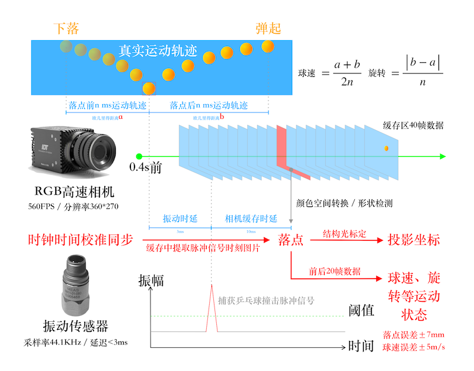
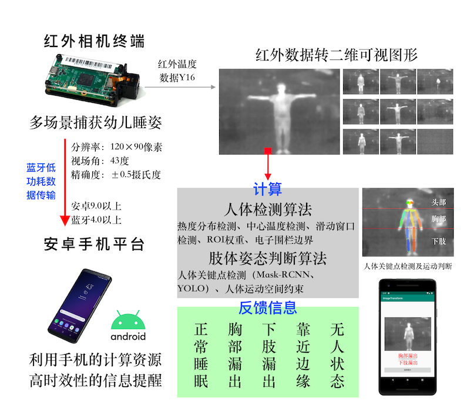

# Resume


I have graduated from SUSTech in July, 2019. My major is CSE and I am interesting on Computer Vision and Machine Learning. Experience a four-year English learning environment and learn new things quickly. I have studied *Financial Accounting*, *Internet of Finance* and some other Fin-tech courses. 

My capstone design is *Real-time 3D human skeleton reconstruction based on camera array system* which is the No.2 project design @College of Engineering of SUSTech. I have focused on this project during my last year in SUSTech. I hope to do some related works about *Computer Vision* & *Machine Learning*.

I chose to have a gap year began on July, 2019. I am a teach assistant of Machine Learning & Intelligent Robots courses in SUSTech and I am also doing some other research projects.
## Education

| Date        | School         | Department |
|:-------------:|:------------------:|:------:|
| 2015-2019           | [Southern University of Science and Technology](https://www.sustech.edu.cn) | [CSE](http://cse.sustech.edu.cn) |
| 2017.summer | [University of British of Columbian](https://www.ubc.ca)  | ECE |

## Experience

* 2015 - *the beginning of my UG life*
    * Have participated in school student associations, school league committees, alumni associations and other student organizations, like the establishment of football clubs, photography studios.
* 2016
    * NanShan [Formula_SAE](https://www.fsaeonline.com) Team - Department of Mechanical and Energy Engineering of SUSTech
        * Have took part in the establishment of a 50-students racing team and was responsible for various tasks such as personnel and finance and served as a team manager.
    * Department of Publicity and Public Relations of SUSTech
* 2017
    * [Shenzhen Publishing Group](https://h5.szbookmall.com) - Kylin Bookbar in SUSTech
* 2018
    * [Baker Tilly China Certified Public Accountant](http://www.tzcpa.com)

## Projects

### Current Projects
* Real-time pingpong detection based on RGB-Camera

* babyCare based on Infrared-Camera

[roboeye Intro](./assets/files/roboeyeIntro.pdf).
* 低质量的手机LCD屏下指纹图像识别技术
* 危险车辆多视角盲区图像拼接


### Precious Projects

|         | Title          | Abstract | Time |
|:-------:|:------------------:|:------:|:----|
| 1 | The Sound based on Tesla High-voltage Electric Current | Using our device to play music | 2016.10 |
| 2 | Rubik's Cube Solving Robots | Develop the algorithm based on OpenCV and the robot could solve the Rubik's Cube automatically | 2017.4 |
| 3 | Real-time AR-Sandbox | Projection in sandbox and dynamic imaging to build in 3D model based on Linux and Miscrosoft Kinect v2.0 | 2017.9 |
| 4 | Projects of AI Course | Solving CARP path planning, identify MINST ,finish the Go game | 2017.9 |
| 5 | Sudoku based on STM32 | Making a Sudoku game platform through the infrared control structures based STM32 and LSV displayer | 2017.11 |
| 6 | Unmanned Aerial Vehicle Cluster in Distributed Control | Multiple unmanned aerial vehicles control based on ROS and Rviz system | 2017.12 |
| 7 | Comprehensive Analysis of the Campus Network | Analysis the campus wireless network signal distribution | 2017.12 |
| 8 | Vehicle Changing Lane | Explore a polynomial five times | 2018.3 |
| 9 | Android App Develop | Work with [Intellifusion](https://www.intellif.com) to build an automatic data annotation platform | 2018.6 |
| 10 | Intelligence Data Analysis | Using fundamental functions like PCA, word2vec to analyze data | 2018.7 |
| 11 | Android Apps Test | - | 2018.9 |
| 12 | Capstone Design | Real-time 3D human skeleton reconstruction based on RGB-camera array 实时三位人体骨骼模型重建RGB相机阵列系统，多视角彩色图像通过深度神经网络获取二维人体骨骼信息后进行三维模型重建，有效避免封闭空间中特殊人群监护的遮挡问题，通过多视角信息的约束提高检测的准确率与置信度 | 2018.8-2019.7 |
| 13 | Intelligent Pingpong System | Detecting pingpong break-point instantly 乒乓球瞬时检测系统，系统检测达到200次击球不漏检，识别误差<4cm，在专业乒乓球训练球馆已完成部署 | 2019.7 |
| 14 | Baby-care System based on Infrared Camera | Detecting whether baby covered normally at night in the case of low light 热成像的红外信息可在复杂环境中监测婴幼儿睡眠状况，系统可应用在家庭婴幼儿卧室、幼儿园等场景 | 2019.12 |
| 15 | Low-quality LCD-fingerprint Recoginition | 低质量的手机屏下指纹图片识别，部分成果达到业界要求FRR<2% FAR<1/50000 | 2020.5 |


* * *


```
I am looking for 2021 Spring/Fall PhD program.
```

### Personal Statement
Dear esteemed professor, I’m Yiheng Xue graduating from Southern University of Science and Technology (QS: 14th in China in 2020, THE: 8th in China in 2020) in July, 2019. When I was about to graduate, I got an opportunity to stay in my tutor's company to be responsible for implementation of the projects which has started before. So I chose a gap year. Nowadays, I am a teaching assistant of two courses, machine learning and computer vision.

I have ever tried many majors. In my freshman and sophomore year, I joined the Departments of Environmental Engineering, Mechanical Engineering and Materials Science and Engineering successively and got some preliminary understanding of scientific researches. After that, I decided to join CSE in my junior year and has been engaged in the research of computer vision so far. After joining CSE, my GPA is above 3.6/4.0. Meanwhile, my project “Real-time 3D human skeleton reconstruction based on RGB camera array” won the 2nd prize in Capstone Design of the College of Engineering. The instructors (Prof. Hao, Prof. Zhang@SUSTech, Dr. Wu@HUAWEI Technologies Co., Ltd) highly approved the project.

In addition to studies, I like sports very much and also served as the captain of our college football team. I am also good at photographing and I have ever established an independent video studio and was responsible for shooting and editing campus promotion videos and drama videos. I have excellent organization and coordination skills as well. I was involved in founding the FSAE Formula Racing team and responsible for marketing and management.

After nearly a year of work, I became more interested in scientific research. When I got the actual needs of many small businesses in Shenzhen, I hope to solve the problems with them through technical methods. In the field of computer vision that I am studying, scientific research projects are ahead of industrial projects by nearly a decade. It is very critical to how to convert laboratory results into industrial results. And I really love to learn new knowledge. I stayed up late in order to understand the latest YOLO-v4 on that day. Due to the YOLO in my project, I’m trying to use the latest YOLO-v4 to optimize my entire project. Gradually, I became more and more calm. And I have learned to precipitate myself and enjoyed loneliness, so that I can focus more on the scientific problems. Scientific research is indeed time-consuming and difficult. However, every time I had discussions with tutors or experienced seniors, I would get benefited a lot and be inspired.

Last but not least, I really hope I can devote myself to scientific research and get this opportunity.
